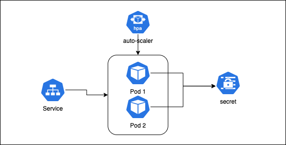

# README

## How to run this project

### Requirements
To run this project you will need:
* dockerhub account
* configured k8s
* helm 
### Architecture
This chart will create a deployment, hpa, service, serviceAccountand  secret.


### Running the project
For simplicity I've uploaded my image to a public dockerhub `rodrigokondo/rails-hello-world:latest`, added the rails master key to the chart values and packaged the helm chart in this repo, so you can run `helm install [NAME] [CHART]`, in this case:
````
helm install hello-world chart-0.1.0.tgz
````

### From scratch
You can do this from scratch as well:
  * (Recommended) Create a new `RAILS_MASTER_KEY`
  * Build your image `docker build . -t [ TAG]`
  * Push your image to  which image host you prefer
  * If you created a new `RAIL_MASTER_KEY` update the value in `chart/values.yaml`, changing `rails.masterkey` to your master key
  * run helm install `helm install [NAME] [CHART]`

## Manage Terraform

### Terraform state file
To manage multiple state files. I would make use of S3 as a backend, and manage which environment I'm working on, by changing backend.tf with a sed to change my the path before initing terraform something like:
````
terraform {
  backend "s3" {
    bucket = "infrastructure"
    key    = "environments/${ENVIRONMENT}.tfstate"
    region = "us-east-1"
  }
}
````

`sed -i '' 's/${ENVIRONMENT}/production/g'`

````
terraform {
  backend "s3" {
    bucket = "infrastructure"
    key    = "environments/production.tfstate"
    region = "us-east-1"
  }
}
````
### Terraform variables and secrets

First separate what's a secret and what's a config, and store the secrets in a encrypted way in (S3 or AWS SSM Parameter Store, or any sort of tooling that supports it)

## Monitoring 

One important thing in monitoring to me is centralized monitoring to be able to correlate logs/metrics, so using newrelic, I would leverage all features provided using the APM, infrastructure monitoring, and logs. And to complete the stack define thresholds, opsgenie and slack for alerts and notices.

Key monitoring points, 
* APM and application logs to have a good view of the application.
* Clustes agents to get metrics and events. 
* Logs from loadbalancers.
* Notices when new application versions are deployed.
* Health checkers for all internal tooling.
* Metrics from databases.
* Notices when new terraform versions are deployed.
