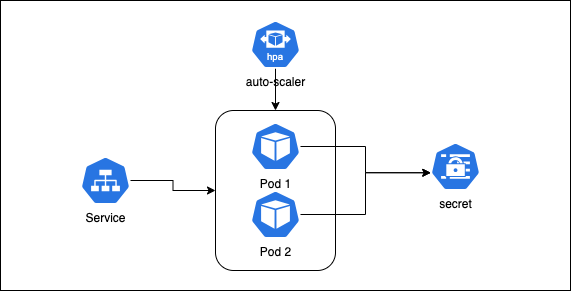
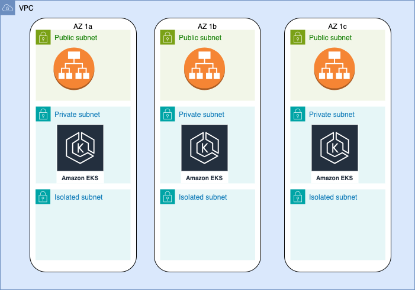

# README

## How to run this project

### Requirements
To run this project you will need:
* dockerhub account
* configured k8s
* helm 
### Architecture
This chart will create a deployment, hpa, service, serviceAccountand  secret.


### Running the project
For simplicity I've uploaded my image to a public dockerhub `rodrigokondo/rails-hello-world:latest`, added the rails master key to the chart values and packaged the helm chart in this repo, so you can run `helm install [NAME] [CHART]`, in this case:
````
helm install hello-world chart-0.1.0.tgz
````

### From scratch
You can do this from scratch as well:
  * (Recommended) Create a new `RAILS_MASTER_KEY`
  * Build your image `docker build . -t [ TAG]`
  * Push your image to  which image host you prefer
  * If you created a new `RAIL_MASTER_KEY` update the value in `chart/values.yaml`, changing `rails.masterkey` to your master key
  * run helm install `helm install [NAME] [CHART]`


## Terraform

### Infrastructure

Using [AWS VPC Module](https://github.com/terraform-aws-modules/terraform-aws-vpc). I'm creating a 3 level vpc with public,private and isolated subnets making use of multiple AZs to ensure high availability.
And [AWS EKS Module](https://github.com/terraform-aws-modules/terraform-aws-eks) to create a EKS cluster on the previously created VPC.



### Manage Terraform

#### Terraform state file
To manage multiple state files. I'm using S3 as a backend and S3 lockfile, and manage which environment I'm working on, by changing backend.tf with a sed to change my the path before initing terraform something like:
````
terraform {
  backend "s3" {
    bucket = "infrastructure"
    key    = "environments/ENVIRONMENT.tfstate"
    region = "us-east-1"
  }
}
````

`sed -i '' 's/${ENVIRONMENT}/production/g'`

````
terraform {
  backend "s3" {
    bucket = "infrastructure"
    key    = "environments/production.tfstate"
    region = "us-east-1"
  }
}
````
I've choose this approach to support a pipeline managements of this terraform. Initializing the terraform at each execution of the pipeline and making use of git flow model to know exactly which environment I should change based on the branch I merged the code.


### Terraform variables and secrets

Either store variables on `environments/${ENVIRONMENT}.tfvars` like I'm doing here or store the tfvars on a management tool or S3.

### Terraform Testing 

To be honest depends on which part I'm testing. if it's something small or that I can recover fast, with minimal impact to the dev team I'm using the staging environment (to me everybody is eligible to break staging dev and ops should be able to test stuff) if it's something totally new/ big change I'm duplicating the infrastructure and testing on a new environment. To me it depends what I'm testing. 

## Monitoring 

One important thing in monitoring to me is centralized monitoring to be able to correlate logs/metrics, so using newrelic, I would leverage all features provided using the APM, infrastructure monitoring, and logs. And to complete the stack define thresholds, opsgenie and slack for alerts and notices.

Key monitoring points, 
* APM and application logs to have a good view of the application.
* Clustes agents to get metrics and events. 
* Logs from loadbalancers.
* Notices when new application versions are deployed.
* Health checkers for all internal tooling.
* Metrics from databases.
* Notices when new terraform versions are deployed.

## Project

### Testing

To test this project on AWS you will need to follow a few steps:

1. edit `terraform/backend.tf` adding your backend to it either changing `bucket = "my-bucket` or removing the s3 backend completely.
2. Also you can use `terraform/init-terraform` script to initialize it. From inside `terraform/` 
````
./init-terraform demo
````
3. Run `terraform apply -auto-approve -var-file environments/demo.tfvars`
4. Use AWS to grab the kubeconfig from the newly created EKS with  `aws eks update-kubeconfig --region REGION_CODE --name CLUSTER_NAME` in this case: `aws eks update-kubeconfig --region us-east-1 --name demo-cluster`
5. Now you can deploy the application. From this project root folder run `helm install hello chart/ -f chart/values-eks.yaml`
6. Now you should see a load balancer and accessing it on port `:80` you should be able to see the hello world page.
